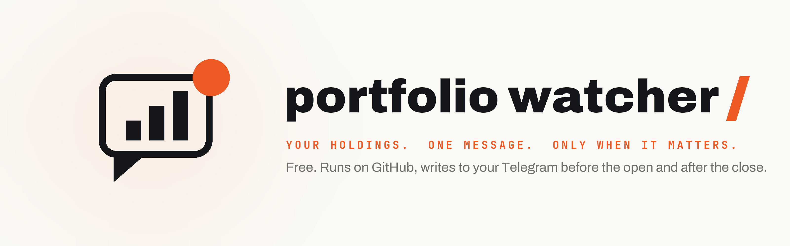

# Portfolio watcher

<p align="center">
  <a href="https://github.com/shubhamsborkar/portfolio-watcher">
    <picture>
      <source media="(prefers-color-scheme: dark)" srcset="docs/cover-dark.png">
      
    </picture>
  </a>
</p>

<p align="center">
  <a href="https://github.com/shubhamsborkar/portfolio-watcher/actions/workflows/watch.yml"></a>
  <a href="https://github.com/shubhamsborkar/portfolio-watcher/generate"></a>
  <a href="https://telegram.org"></a>
  <a href="LICENSE"></a>
  <a href="https://ai.shikshannivesh.com"></a>
</p>

A free program that checks your stocks twice every weekday, before the US market opens and after it closes, and sends you one short Telegram message when something that matters to them has happened: a company filed its results, an insider bought or sold, a holding moved 5% in a day, a commodity or currency your names depend on broke out of its range, a rate crossed a line. On a quiet day it sends nothing.

It needs no computer of your own. GitHub runs it for free in your own private copy, the Telegram bot is free, and everything it reads (the SEC, the St. Louis Fed, Yahoo Finance, Nasdaq's calendar, Google News) is free and public. No AI runs in the check: it is plain code, so it costs nothing and says the same thing every day.

The edition that explains why it exists and walks through the setup with screenshots is [Equity research with AI, minus the AI bill](https://ai.shikshannivesh.com/p/equity-research-with-ai-minus-the) in the *Alpha with AI* newsletter.

## How it works, in plain words

Three things are involved, and it helps to know which is which.

**Your copy** is a private folder on GitHub with the program and your list of stocks in it. GitHub's computers run the program on a timetable (its "Actions"), free of charge for a private copy. Nobody else can see the folder.

**Your bot** is a Telegram account that only the program writes to. You make it in a minute with Telegram's own @BotFather, and it is yours alone.

**The data** is the public record. Results and filings come from the SEC's EDGAR system, prices from Yahoo Finance, rates and spreads from the St. Louis Fed's FRED, results dates from Nasdaq, headlines from Yahoo Finance's own news feed and Google News. None of it needs an account or a key.

Each run reads your list, checks the record, and writes one message if there is news. It keeps a small memory file in your copy so you never get the same alert twice.

## What arrives on your phone

**The first run** sends a hello and a map of how your portfolio connects: each commodity, currency and rate, and which of your names are tied to it. Crude touches an airline, a ride-hailing company and a retailer at the same time; the euro touches every company that earns in Europe.

After that, each check sends one message, in this order of priority, and only the parts that have something in them:

1. **Results.** When a company on your list files its results with the SEC (a form 8-K with item 2.02), the program opens the press release and quotes its own sentences on revenue, earnings per share and the outlook, word for word, with a link to the release. Each result gets its own message. If you like to write a test before results, you can also give it one number to check, and it tells you whether the release cleared your line.
2. **New filings.** Everything else a holder should hear about from the SEC, in plain words with a link: an insider buying shares on the open market, an insider selling outside a pre-set trading plan, a material 8-K (a major agreement signed or ended, an acquisition, new debt, restructuring costs, a write-down, a senior officer joining or leaving, a change of auditor, earlier accounts that can no longer be relied on), the quarterly and annual reports, and an investor filing an activist-size stake (13D). Routine insider sales under pre-set plans are added up and shown once a week instead.
3. **Big moves in your holdings.** A holding that moved 5% or more in a day, with its move over the past month for context.
4. **What your portfolio depends on.** A commodity or currency your holdings are tied to breaking out of its range: a new three-month high or low, with the range it had been in and the names in your portfolio tied to it. A swing of a few percent inside a range is noise, so it never fires.
5. **Rates and markets.** The 10-year and 2-year Treasury yields, high-yield credit spreads and the dollar reaching a three-month high or low, and the VIX crossing above 25, each with one line on why it matters.
6. **In the morning, riding along only when one of the sections above has news:** the day's high-impact US releases (CPI, jobs, the Fed), the newest headline that names each of your first three holdings, and one headline from a trusted outlet for each theme you follow in `themes.txt` (a strait, a war, a tariff).

**Every Monday morning, the portfolio as a whole:** your largest positions, how the portfolio moved over the last five trading days, how much of it has revenue or costs tied to each commodity and currency, which holdings report results in the next five trading days, and the insider sales under pre-set plans since the Monday before. It describes your portfolio; it never tells you what to do with it. If your list has no share counts, it says so and counts names instead of inventing weights.

Once something fires, it stays quiet for five days, so a trend does not message you every day. A quiet day, morning included, sends nothing.

This is a results message, exactly as it arrives (Hilton Grand Vacations, replayed from its July 2026 filing):

> 📄 **Results filed: Hilton Grand Vacations (HGV)**
> Filed with the SEC on 30 Jul 2026.
>
> **From the release**
> • **Revenue:** *"Total revenues were $1.358 billion."*
> • **Earnings per share:** *"Net income attributable to stockholders was $12 million and diluted EPS was $0.15."*
>
> Read the release

## What it costs

Nothing. A private copy on GitHub gets 2,000 free minutes of running time a month. Our own copy with 23 names takes about 40 seconds a run, which GitHub counts as one minute, so two runs every weekday use about 44 of them.

## Set it up in the browser, every click (about ten minutes)

You need a free GitHub account and Telegram on your phone. Nothing is installed on your computer.

**1. Make your Telegram bot.** This is where the messages will arrive.

- In Telegram, search for **@BotFather** and open it.
- Send it the message `/newbot`.
- It asks for a name. Type anything; "Portfolio watcher" is fine.
- It asks for a username, which has to end in `bot`. Type one.
- It replies with a token, a long line of letters and numbers. Copy it somewhere safe. Anyone who has it can write to you as your bot, so it is yours alone.
- Search Telegram for the username you just made, open the chat, and send it any message. "hi" is enough. The program needs one message from you to know where to write.

**2. Find your chat ID.** In your browser, open this address with your token in place of `TOKEN`:

```
https://api.telegram.org/botTOKEN/getUpdates
```

Look for `"chat":{"id":` followed by a number. That number is your chat ID. (If the page shows `"result":[]`, send the bot one more message and reload.)

**3. Make your own copy of the program.** At the top of this page, click **Use this template**, then **Create a new repository**. Give it a name ("portfolio-watcher" is fine), choose **Private** so your holdings list is visible only to you, and click **Create repository**. GitHub opens your copy.

**4. Paste the three settings.** They live in your copy's settings, where GitHub encrypts them and never shows them again, even to you.

- In your copy, click the **Settings** tab along the top.
- In the left-hand menu, click **Secrets and variables**, then **Actions**.
- Click **New repository secret**. In Name type `TELEGRAM_TOKEN`, in Secret paste the token from BotFather, click **Add secret**.
- Click **New repository secret** again. Name `TELEGRAM_CHAT_ID`, Secret the number from step 2. Add it.
- Once more. Name `SEC_EMAIL`, Secret your email address. The SEC asks every program that reads its filings to say who is calling, and the address goes nowhere else.

**5. Put in your stocks.** Click the **Code** tab, open `stocks.txt`, and click the pencil icon. Replace the examples with your own, one per line: the ticker, a space, and the number of shares you hold, like `UBER 120`. A ticker on its own is a name you watch but do not own. Click **Commit changes**, then **Commit changes** again. Whenever you buy or sell, change the line the same way.

**6. Switch it on.** Click the **Actions** tab. If GitHub asks, click the green button to enable workflows. Click **Portfolio watcher** in the left-hand list, then **Run workflow** on the right, then the green **Run workflow** button. In a minute or two your bot writes to you: a hello, and the map of how your holdings connect. From then on it runs by itself before the US market opens and after it closes, every weekday.

**Want to see a results message now?** On the same **Run workflow** button, type a ticker in the box (for example `ACN`) and run it. It sends you that company's latest results, marked as a replay. The dropdown above the box also sends the morning note, the Monday check or the map on demand.

**If something does not arrive.** Open the **Actions** tab and click the latest run. Its log shows every message it sent, and if a setting is missing it says which one in a yellow warning at the top.

### Or hand the setup to Claude

If you use Claude Code, it can make the copy and write your stocks for you; only the Telegram bot, a GitHub key for Claude and the three settings need your own hands. The key is made at GitHub, Settings, Developer settings, Personal access tokens, Fine-grained tokens: All repositories, with Actions, Administration, Contents, Secrets and Workflows set to Read and write; delete it once the watcher runs. Then paste this to Claude, with your own details:

```
Set up the portfolio watcher for me from the template at github.com/shubhamsborkar/portfolio-watcher. Here is my GitHub key: [paste the key]. Make a private copy in my account called portfolio-watcher. Write my stocks into stocks.txt, one per line, ticker then shares: UBER 120, SPGI 15, NXPI. Then find my Telegram chat ID; my bot token is [paste the token]. Then tell me exactly where on GitHub to paste the three settings, TELEGRAM_TOKEN, TELEGRAM_CHAT_ID and SEC_EMAIL, and my email is [your email]. Once I tell you they are in, start the first run.
```

The edition linked at the top shows every screen of that route.

## Your stocks, and the optional extras

`stocks.txt` is all most people need:

```
UBER 120
SPGI 15
NXPI
```

The shares are what the Monday check uses to weight your portfolio. For a listing outside the US, use Yahoo Finance's symbol (`RELIANCE.NS 10`); the results and filings checks cover companies that file with the SEC, and the hello message names any that do not.

**What your stocks depend on is filled in for you where it is plain.** The program reads each company's industry code at the SEC and ties a copper miner to copper, a utility to natural gas, an apparel maker to cotton, an airline to crude, and so on. The codes are broad: a ride-hailing app is filed as "business services", so its fuel cost is not guessed, and currencies are never guessed. The first message tells you which names it filled in and which are still unknown.

**The extras live in `watchlist.csv`, and every column is optional.** Add a row only for a name you want to say more about; its ticker is enough to match it to `stocks.txt`.

| Column | What to put in | Example |
|---|---|---|
| `ticker` | the ticker | `UBER` |
| `exposures` | what the company buys (cost) or sells (revenue), separated by `;`. Yours replace the guess | `wti:cost; eurusd:revenue` |
| `keywords` | words that put matching stories first in the morning headline | `robotaxi` |
| `look_for` | for people who write a test before results: the words that sit right before the number you care about in the results release | `Gross Bookings grew ... to` |
| `test` | your line for that number, starting with at least, at most, above or below | `at least 45` |
| `note` | anything you want repeated back to you in the results message | `Fuel is the drivers' cost` |

A few things that help:

- **The exposure names** come from `data/commodities.json`. The common ones: `wti` and `brent` (crude), `natgas_us`, `gasoline`, `copper`, `aluminium`, `gold`, `silver`, `uranium`, `wheat`, `corn`, `coffee`, `cocoa`, `cotton`, `eurusd`, `gbpusd`, `usdjpy`, `usdcny`, `usdinr`.
- **Not sure what a company is exposed to?** Its annual report says. On your own computer, `python watch.py --exposures UBER` lists every commodity and currency word in Uber's latest annual report with the sentence around it. The program only counts words; you decide which ones are real. In Uber's report the word "sugar" turns up twice, and both times it is the chairman, Ronald Sugar. Or give the annual report to Claude or ChatGPT once and ask which commodities and currencies are a real cost or revenue for the business.
- **If you write a results line, copy `look_for` from the company's last release.** Apple writes "quarterly revenue of", Microsoft writes "Revenue was". Three dots stand for a few words in between. Write the `test` number in the units the company uses: if it reports in millions, your line is in millions.
- **Put your main holdings at the top of `stocks.txt`.** The morning headlines come from the top of the list down.
- **Headlines come from Yahoo Finance's news for each ticker** and must name the company. Themes that are not one company, a strait, a war, a tariff, go in `themes.txt`, one per line, and only trusted outlets count for those.

## Connect your broker instead of keeping a list

The list in `stocks.txt` works with any broker, but you have to update it every time you buy or sell. If your broker offers an API (a door the broker opens so a program can read your account), the watcher can read your holdings from the broker before every check instead, so a new position is watched from the next run without you touching anything.

**How it works.** You add one more setting named `BROKER` with your broker's name from the table, and the keys that broker hands out from its own website, the same way you added the Telegram ones. At the start of every run the program signs in with those keys, asks the broker for the list of what the account holds and what each holding is worth, and uses that as your list: every holding is watched, and the Monday check weights the portfolio by the broker's own values. Anything in `stocks.txt` that the broker does not hold is still watched as a name you follow, and your extras in `watchlist.csv` still apply. The hello message tells you what it found, for example "6 from your broker and 17 more from your list".

The watcher only reads. Nothing in it places an order. The broker files are the same ones [GreekSoup](https://github.com/shubhamsborkar/greeksoup), the open-source one-person equity research desk, uses to read readers' accounts, and each broker's name in the table links to the GreekSoup page that shows where its keys are made.

| Broker | Where | `BROKER` | Secrets to add |
|---|---|---|---|
| [Alpaca](https://greeksoup.ai/docs/brokers/alpaca/) | United States | `alpaca` | `ALPACA_KEY`, `ALPACA_SECRET`, and `ALPACA_PAPER` set to `on` for a paper account |
| [Interactive Brokers](https://greeksoup.ai/docs/brokers/interactive-brokers/) | worldwide | `ibkr_flex` | `IBKR_FLEX_TOKEN`, `IBKR_FLEX_QUERY` (a Flex Query of your positions, made once in Client Portal) |
| [Tradier](https://greeksoup.ai/docs/brokers/tradier/) | United States | `tradier` | `TRADIER_TOKEN`, optional `TRADIER_ACCOUNT` |
| [tastytrade](https://greeksoup.ai/docs/brokers/tastytrade/) | United States | `tastytrade` | `TASTY_CLIENT_SECRET`, `TASTY_REFRESH_TOKEN`, optional `TASTY_ACCOUNT` |
| [Trading 212](https://greeksoup.ai/docs/brokers/trading-212/) | United Kingdom, Europe | `trading212` | `T212_KEY`, `T212_SECRET` |
| [Longbridge](https://greeksoup.ai/docs/brokers/longbridge/) | Hong Kong, Singapore | `longbridge` | `LONGBRIDGE_APP_KEY`, `LONGBRIDGE_APP_SECRET`, `LONGBRIDGE_ACCESS_TOKEN` (renew it every ninety days) |
| [Dhan](https://greeksoup.ai/docs/brokers/dhan/) | India | `dhan` | `DHAN_CLIENT_ID`, and either `DHAN_ACCESS_TOKEN` or `DHAN_PIN` with `DHAN_TOTP_SECRET` |
| [Angel One](https://greeksoup.ai/docs/brokers/angel-one/) | India | `angel_one` | `ANGEL_API_KEY`, `ANGEL_CLIENT_CODE`, `ANGEL_PIN`, `ANGEL_TOTP_SECRET` |
| [Groww](https://greeksoup.ai/docs/brokers/groww/) | India | `groww` | `GROWW_API_KEY`, and `GROWW_API_SECRET` or `GROWW_TOTP_SECRET` |

**What to know before you do it:**

- Your broker keys sit in your private copy's secrets, which GitHub encrypts and never shows again, even to you. Most brokers' keys can also trade, so treat them like a password: keep your copy private, and where your broker offers a read-only key, use that. Alpaca's paper account is a safe place to try it first.
- The Indian brokers in the table need your trading PIN and the secret behind your authenticator app, because their rules ask for a fresh login each day and this is how the watcher logs in by itself. If you would rather not store those, keep the list.
- Brokers that need you to log in by hand every day (Schwab, Robinhood, Saxo, Zerodha, ICICI Direct, Upstox) cannot work on a schedule while you sleep, so for those the list is the way. Brokers with no API for individuals (Fidelity, Vanguard and most app-only brokers) are the same.
- **Where this has been proven.** We have read an Alpaca paper account with these files on a computer, and that is the account our own test copy is set up with. If a broker fails to connect, the run's log says why in plain words, and `stocks.txt` still works. GreekSoup's [broker will not connect](https://greeksoup.ai/docs/help/broker-will-not-connect/) page covers the usual causes.

## Set it for your market

It is set for the US market. To move it, open `.github/workflows/watch.yml` in your copy, click the pencil icon, and change the two `cron` lines. The times are in UTC, and `1-5` means Monday to Friday.

| Market | Before the open | After the close |
|---|---|---|
| United States (the default) | `"30 12 * * 1-5"` | `"30 21 * * 1-5"` |
| India | `"0 3 * * 1-5"` | `"0 11 * * 1-5"` |
| United Kingdom and Europe | `"0 6 * * 1-5"` | `"0 17 * * 1-5"` |

The results and filings checks read SEC filings, so they cover companies that file in the US. The calendar is US releases. Prices, breakouts and headlines work for any market Yahoo Finance covers.

## Changing the alerts

The thresholds sit at the top of `watch.py`, each with a line saying what it does: the daily move for a holding (5%), the range a breakout is measured against (about three months), how close to its five-year high a breakout has to be for the message to say so (2%), how long an item stays quiet after it fires (five days), and how many headlines you get. Change a number, commit, and the next run uses it. If you use an AI coding agent, describing the change in a sentence works too: *make the daily move 3% and add Brent to Uber's costs*.

## Where AI comes in

Only in two places, and both are optional. When you build your list, an AI can read each annual report once and tell you what each company buys and sells. And when a press release is laid out in a way the code cannot read, you can add an `OPENROUTER_API_KEY` secret, and a cheap model is asked for that one sentence. The program keeps the sentence only if it is word for word in the release, and the message says it was read by the model.

## Ask it questions (optional)

The watcher only talks; it does not answer. If you want to reply to an alert in Telegram and ask "what does this filing mean?", Claude Code can be connected to the same bot. Ask Claude to set it up for you: the Telegram channel for Claude Code works while Claude Code is running on your computer, and a routine in Anthropic's cloud can do it with your computer off. Both are research previews at the time of writing, so the steps may change.

## Limits

- A headline is matched on the first two words of the company's name (Hilton Grand, S&P Global) or its ticker, so a story about another company with a similar name can still slip through; the link always shows which it is.
- The results quotes work on most US releases. A release laid out only as tables gives fewer lines, and a company that leads with its own measure (PTC leads with ARR) may show only the outlook; the link is always there. When the code cannot find your own words, the message says so.
- Companies listed outside the US do not file with the SEC, so they get the price, exposure and headline checks but no results or filings check. The hello message names them.
- Some commodities have no free daily price (uranium, lithium and a few others). They appear on the map, marked as not watched, because only a daily price can break out of a range.
- Dividends are not tracked yet.
- Yahoo Finance's price data is free but unofficial, and it can change without notice.
- This program sends information. It does not tell you what to buy or sell, and it places no orders.

## Run it on your own computer instead

If you would rather not use GitHub, it also runs on your own computer with Python and no installs: set the same settings as environment variables and run `python watch.py`. It only checks while the computer is on, so you need a scheduler (Task Scheduler on Windows, launchd or cron on a Mac) to run it twice a day. On a Mac whose Python came from python.org, the program notices the missing certificates and reads through curl instead.

Other ways to run it by hand:

- `python watch.py --dry-run` prints the message instead of sending it.
- `python watch.py --morning` includes the calendar and headlines now.
- `python watch.py --map` sends the map of how your holdings connect.
- `python watch.py --week` sends the Monday portfolio check now.
- `python watch.py --replay ACN` re-reads Accenture's latest results and sends them again.
- `python watch.py --chat-id` prints your chat ID after you message your bot.

## Built with an agent

The code was written by Claude Code from plain-English descriptions and tested on the author's own list of 23 names. The decisions are the author's: what a holder needs to hear about and what is noise, why results come first and headlines last, why a quiet day sends nothing, why the program quotes a release instead of summarising it. The commodity and currency map in `data/commodities.json` and the broker files in `brokers/` come from [GreekSoup](https://github.com/shubhamsborkar/greeksoup), under the MIT licence.

## Community

- **A question, or an idea**: [Discussions](https://github.com/shubhamsborkar/portfolio-watcher/discussions), in the open, so the answer serves the next reader too.
- **Something wrong**: open an [issue](https://github.com/shubhamsborkar/portfolio-watcher/issues) with the run's log pasted in; the log never contains your settings.
- **The newsletter**: [Alpha with AI](https://ai.shikshannivesh.com) carries the edition this grew out of. The watcher is made by [Shikshan Nivesh](https://shikshannivesh.com).

## Disclaimer

This is an information tool, published for educational purposes by Shikshan Nivesh. Nothing it sends is investment, legal or tax advice, a recommendation to buy, sell or hold any security, or tailored to anyone's situation. The author is not a registered investment adviser or research analyst. The program reads public filings, market data feeds and news sources; any line it sends can be wrong, late or misread, because feeds change, filings get restated and code has bugs, so verify against the primary source before acting on anything. It places no orders. Investing carries risk, including the loss of capital.

## Licence

MIT, copyright Shikshan Nivesh and Shubham Borkar. See `LICENSE`. Copy it, change it and build on it. It is shared as it is, with no promise of updates.
